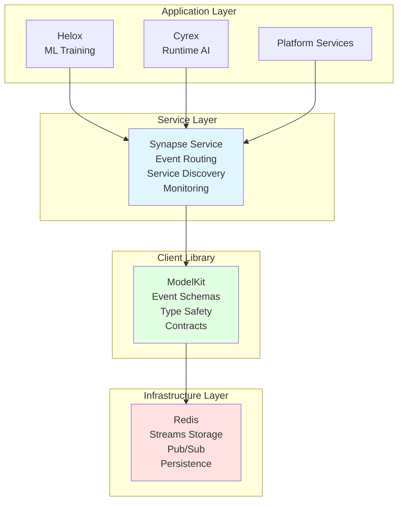
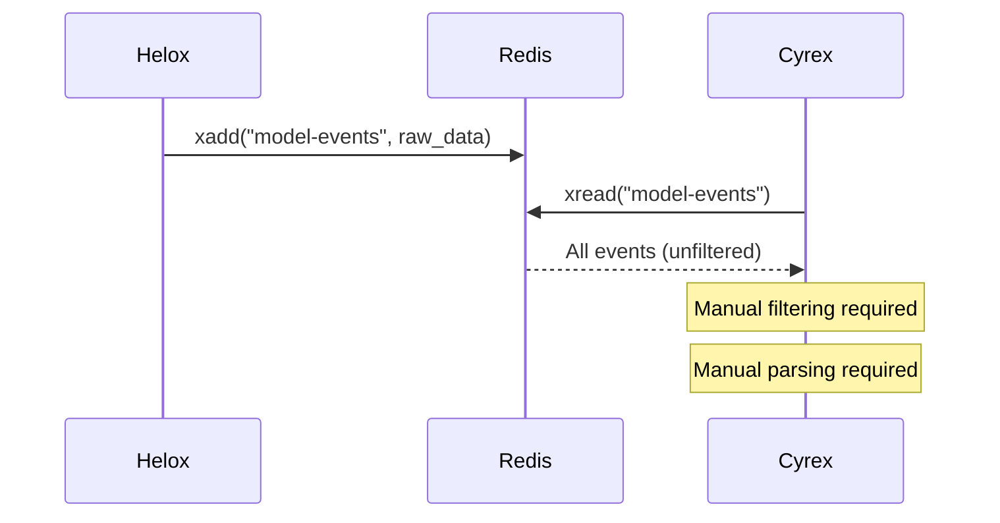
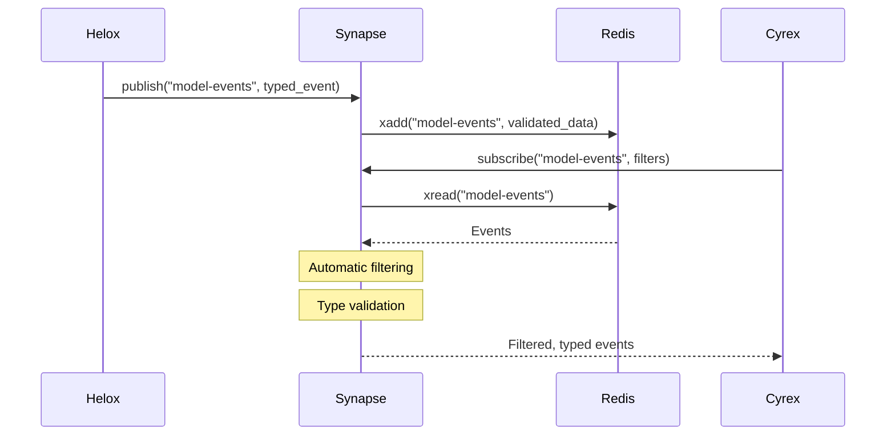

# Synapse Architecture & Redis Distinction

## Overview


## Architecture Layers



## What Redis Provides

Redis is the underlying infrastructure that provides:

- **Storage**: Redis Streams for event streaming
- **Message Delivery**: Basic pub/sub and queue mechanisms
- **Persistence**: AOF/RDB for data durability
- **Transport Layer**: Low-level message passing

### Direct Redis Usage (Low-Level)

```python
# Direct Redis usage - manual, low-level
import redis.asyncio as redis

r = redis.Redis()

# Publish event (raw data)
await r.xadd("model-events", {
    "event": "model-ready",
    "model_name": "classifier",
    "version": "v2.0"
})

# Subscribe (manual, no filtering)
messages = await r.xread({"model-events": "$"})
# You get raw data, must parse and filter yourself
```

**Redis Limitations:**
- No event routing or filtering
- No service discovery
- No built-in monitoring
- No event replay capabilities
- Raw JSON data (no type safety)
- Manual stream management

## What Synapse Adds

Synapse is a service layer that sits on top of Redis and provides:

- **Event Routing**: Intelligent routing based on event types and patterns
- **Service Discovery**: Automatic service registration and discovery
- **Event Replay**: Replay events for debugging and recovery
- **Monitoring**: Prometheus metrics and observability
- **Type Safety**: Uses ModelKit schemas for typed events
- **Abstraction**: Can switch between Redis and Kafka backends

### Synapse Usage (High-Level)

```python
# Synapse usage - high-level, type-safe
from synapse_client import SynapseClient
from modelkit import ModelReadyEvent

client = SynapseClient()

# Publish with type safety
await client.publish("model-events", ModelReadyEvent(
    model_name="classifier",
    version="v2.0"
))

# Subscribe with filtering
async for event in client.subscribe(
    topic="model-events",
    filters={"model_name": "classifier"},  # Automatic filtering
    replay_from="2025-01-01"  # Replay old events
):
    load_model(event)  # Already filtered and typed
```

## Feature Comparison

| Feature | Redis | Synapse |
|---------|-------|---------|
| **Layer** | Infrastructure | Service |
| **Technology** | Redis Streams | Service (uses Redis/Kafka) |
| **Event Routing** | Manual | Automatic filtering |
| **Service Discovery** | None | Built-in |
| **Event Replay** | Manual (complex) | Simple API |
| **Monitoring** | Basic Redis metrics | Business metrics |
| **Type Safety** | Raw JSON | Typed events (ModelKit) |
| **Abstraction** | Low-level | High-level API |
| **Event Schemas** | None | Uses ModelKit schemas |
| **Stream Management** | Manual | Automatic |

## Data Flow Comparison

### Without Synapse (Direct Redis)



### With Synapse



## Use Cases

### Use Redis Directly When:
- Simple pub/sub needs
- Low latency is critical
- Minimal infrastructure desired
- Direct control needed
- Simple event patterns

### Use Synapse When:
- Advanced routing and filtering needed
- Service discovery required
- Event replay for debugging
- Enterprise monitoring needed
- Multi-backend support (Redis + Kafka)
- High throughput (>100K events/sec)
- Type safety important

## Integration Pattern

### Current Pattern (Simple)

```
Helox/Cyrex → ModelKit → Redis Streams
```

**Benefits:**
- Simple and direct
- Low latency
- Easy to understand
- Minimal dependencies

**Limitations:**
- No advanced routing
- Manual service discovery
- Limited monitoring

### Future Pattern (Enterprise)

```
Helox/Cyrex → ModelKit → Synapse Service → Redis Streams
```

**Benefits:**
- Advanced routing and filtering
- Service discovery
- Event replay
- Better monitoring
- Enterprise features

**Trade-offs:**
- Additional service to manage
- Slightly higher latency
- More complex setup

## Summary

**Redis:**
- Infrastructure layer (database/message broker)
- Provides storage and basic message delivery
- Low-level, manual control
- Analogy: The postal service (delivers messages)

**Synapse:**
- Service layer (event streaming hub)
- Provides routing, discovery, monitoring, replay
- High-level, automated features
- Analogy: The traffic control center (manages routing, ensures delivery, tracks everything)

**Relationship:**
- Synapse uses Redis as its backend
- Services can use Redis directly OR go through Synapse
- Synapse adds value-added features on top of Redis
- Both are part of the same event-driven architecture

## Technology Stack

### Redis
- **Technology**: Redis 7+ with Streams
- **Deployment**: Docker, Kubernetes, Cloud (AWS ElastiCache)
- **Persistence**: AOF (Append-Only File) or RDB snapshots
- **Clustering**: Redis Cluster for horizontal scaling

### Synapse
- **Technology**: Python/FastAPI service using Redis Streams
- **Deployment**: Docker container, Kubernetes service
- **Backend Options**: Redis Streams (default) or Apache Kafka (enterprise)
- **Monitoring**: Prometheus metrics, Grafana dashboards

## Decision Matrix

### Choose Redis Directly If:
- [ ] Simple pub/sub needs
- [ ] Low latency critical
- [ ] Minimal infrastructure
- [ ] Direct control needed
- [ ] Simple event patterns

### Choose Synapse If:
- [ ] Advanced routing needed
- [ ] Service discovery required
- [ ] Event replay for debugging
- [ ] Enterprise monitoring needed
- [ ] Multi-backend support (Redis + Kafka)
- [ ] High throughput (>100K events/sec)
- [ ] Type safety important

## Related Documentation

- `README.md` - Synapse overview and features
- `../deepiri-modelkit/README.md` - ModelKit documentation
- `REDIS_MODELKIT_SYNAPSE_COMPARISON.md` - Complete architecture comparison

